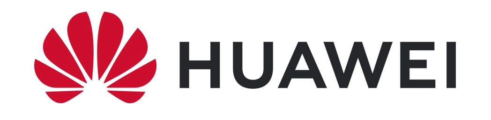

## Hi there 👋

I work at Huawei Technologies  as a research scientist now in Beijing. 

I am now working on language identification, machine translation and LLM Agent research. If you are seeking any form of **employment opportunity**, please feel free to email me at [dingjianbang1@huawei.com](mailto:dingjianbang1@huawei.com). We are also **hiring interns**!

I graduated from [School of Intelligence Science and Technology](https://sai.pku.edu.cn/index.htm), Peking University (北京大学智能学院) with a master's degree, supervised by [Prof. Zhihong Deng (邓志鸿)](https://sai.pku.edu.cn/szdw/zzjs/dzh.htm) and from Qian Xuesen Class, Xidian University (西安电子科技大学钱学森班) with a bachelor's degree. I also collaborate with [Prof. Xu Sun (孙栩)](https://cs.pku.edu.cn/info/1078/1673.htm) closely.

I won the [CCL 2023 Best Poster Award](http://cips-cl.org/?p=87826) and the [Huawei Top-10 Patents Nomination Award](https://www.huawei.com/cn/news/2022/6/ipr-2022) (华为终端BG十大发明提名). [My work](https://www.beidouunion.com/kjzy/news_349.html) was selected by the Xi'an Municipal Government for exhibition at the 2017 Silk Road International Expo (2017丝绸之路国际博览会). I have published several papers at the premier international AI conferences such as IJCNN, NLPCC and CCL. 

### 📎 Homepages
- Personal Pages: https://karrynest.github.io (updated recently🔥)
- Google Scholar: https://scholar.google.com/citations?user=aRXdah8AAAAJ
- DBLP: https://dblp.org/pid/251/8510.html

### 🔥 News
- *2024.08*: [AdaMod](https://github.com/lancopku/AdaMod) optimizer has garnered over 50+ citations and 120+ stars
- *2024.03*: One paper is accepted by IJCNN 2024
- *2023.08*: 🎉 Win the CCL 2023 best poster award
- *2023.07*: One paper is accepted by NLPCC 2023
- *2023.06*: One paper is accepted by CCL 2023

### 📝 Publications 

More details are shown at [my personal homepage](https://karrynest.github.io).

- ``ICLR 2021`` [FastSpeech 2: Fast and High-Quality End-to-End Text to Speech](https://arxiv.org/abs/2006.04558), **Yi Ren**, Chenxu Hu, Xu Tan, et al.
- ``NeurIPS 2019`` [FastSpeech: Fast, Robust and Controllable Text to Speech](https://papers.nips.cc/paper/8580-fastspeech-fast-robust-and-controllable-text-to-speech.pdf), **Yi Ren**, Yangjun Ruan, Xu Tan, et al.
- `ICLR 2024` [Mega-TTS 2: Boosting Prompting Mechanisms for Zero-Shot Speech Synthesis](https://openreview.net/forum?id=mvMI3N4AvD), Ziyue Jiang, Jinglin Liu, **Yi Ren**, et al. 
- ``AAAI 2022`` [DiffSinger: Singing Voice Synthesis via Shallow Diffusion Mechanism](https://arxiv.org/abs/2105.02446), Jinglin Liu, Chengxi Li, **Yi Ren**, et al. 
